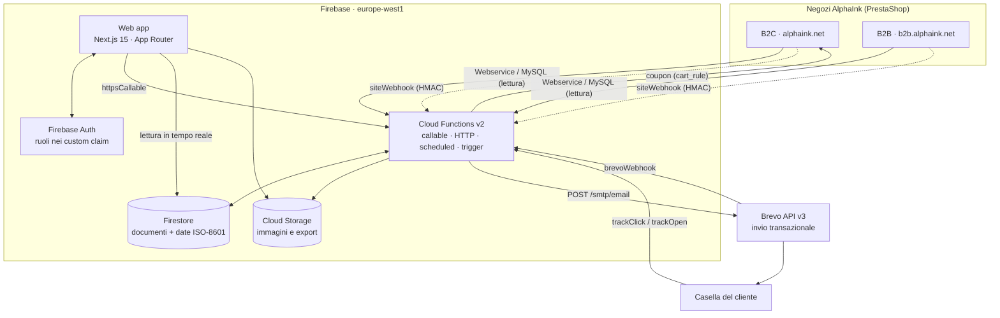

# AlphaInk Newsletter Suite

Applicazione web per creare, pianificare e inviare le newsletter di **AlphaInk**
([alphaink.net](https://alphaink.net)), con i dati dei clienti presi direttamente dai due negozi
PrestaShop dell'azienda, automazioni comportamentali, tracciamento completo del funnel
(consegna → apertura → click → acquisto) e calendario editoriale.

L'invio passa da **Brevo**; tutto il resto (dati, logica, interfaccia) vive su **Firebase**.

---

## Cosa fa

| Area | Funzionalità |
| --- | --- |
| **Contatti** | Sincronizzazione da PrestaShop B2C e B2B, deduplica sull'email normalizzata, import/export CSV, stato di iscrizione, punteggio di engagement, stampanti possedute dedotte dagli acquisti |
| **Cluster** | Segmenti dinamici a regole (albero AND/OR ricorsivo), statici, per gruppo cliente del sito o per lista Brevo; ricalcolo periodico e anteprima prima del salvataggio |
| **Editor email** | Editor a blocchi drag & drop (16 tipi di blocco), stili globali, merge tag, 5 template di sistema, anteprima desktop/mobile e invio di prova |
| **Invio** | Pianificazione, invio immediato, coda scaglionata a batch, pausa/ripresa, A/B test, HTML personalizzato per singolo destinatario |
| **Automazioni** | 6 flussi preconfigurati (4 obbligatori + benvenuto e win-back) con trigger, ritardi, condizioni di annullamento, coupon generati anche su PrestaShop, fasce di silenzio e tetti di frequenza |
| **Tracciamento** | Webhook Brevo, redirector firmato per i click, pixel di apertura, riconoscimento delle aperture proxy (Apple MPP), attribuzione degli ordini con 5 modelli |
| **Analytics** | Dashboard, report per newsletter e per automazione, consolidamento giornaliero, fatturato attribuito per canale |
| **Calendario** | Piano editoriale mensile/settimanale/agenda con riprogrammazione drag & drop |

Tutta l'interfaccia, i messaggi d'errore e i commenti nel codice sono in **italiano**.

---

## Architettura in breve



Il dettaglio completo, con i diagrammi di sequenza di un invio e di un'automazione, è in
[`docs/ARCHITETTURA.md`](docs/ARCHITETTURA.md).

---

## Struttura delle cartelle

```
Alphaink_AI/
├── packages/shared/           @alphaink/shared — tipi, costanti, schemi zod, utility
│   └── src/
│       ├── types/             common, user, site, contact, cluster, email,
│       │                      newsletter, automation, tracking, order, settings
│       ├── constants/         collections, defaults, merge-tags
│       ├── schemas/           schemi zod condivisi fra web e Functions
│       └── utils/             email, format, date, id, family, engagement
│
├── functions/                 Cloud Functions v2 (Node 20, CommonJS)
│   └── src/
│       ├── index.ts           solo wiring: ri-esporta con i nomi del contratto pubblico
│       ├── lib/               config, logger, errors, async, firestore, auth, signing, http
│       ├── newsletters/       callables, compose, sender, dispatcher, repository, triggers
│       ├── clusters/          engine, evaluator, query-planner, brevo-lists, scheduled
│       ├── contacts/          callables, import, export, repository, triggers
│       ├── sync/              adapter PrestaShop (webservice + mysql), orchestrator,
│       │                      normalize, repository, settings, webhook
│       ├── automations/       defaults, enrollment, dispatcher, scanners, coupons, triggers
│       ├── brevo/             client, transactional, contacts, campaigns, senders, webhooks
│       ├── tracking/          webhook, redirect, processor, attribution, metrics,
│       │                      unsubscribe (+ preferenze), webview, layout
│       ├── render/            pipeline, document, blocks, merge-tags, links, inline, text
│       ├── media/             signed upload + libreria immagini
│       ├── users/             ruoli, custom claim, bootstrap del primo owner
│       └── seed/              seedDefaults + template di sistema
│
├── apps/web/                  Next.js 15 · React 19 · Tailwind 3.4
│   └── src/
│       ├── app/
│       │   ├── (auth)/login   accesso
│       │   ├── (dashboard)/   dashboard, calendario, newsletter, automazioni,
│       │   │                  contatti, cluster, analytics, media, impostazioni
│       │   └── api/           health, preview/[id], export/contacts
│       ├── components/        editor, newsletter, calendar, clusters, contacts,
│       │                      automations, analytics, dashboard, settings, layout, ui
│       └── lib/               firebase (client/admin), hooks, auth-context, query-client
│
├── firestore.rules            permessi per ruolo
├── firestore.indexes.json     indici compositi
├── storage.rules              media pubblici in lettura, scrittura per ruolo
├── firebase.json              hosting, functions, emulatori
└── docs/                      questa documentazione
```

---

## Prerequisiti

- **Node.js 20** (`engines.node: >=20` nella radice; le Functions girano su `nodejs20`)
- **npm 10+** (il monorepo usa gli npm workspaces)
- **Firebase CLI** (`npm i -g firebase-tools`), autenticata con `firebase login`
- Un progetto Firebase sul **piano Blaze** (le Functions v2 e le chiamate HTTP in uscita
  verso Brevo e PrestaShop non sono disponibili sul piano gratuito)
- Un account **Brevo** con un mittente verificato
- Accesso ai due negozi PrestaShop: chiave Webservice **oppure** un utente MySQL in sola lettura

---

## Avvio rapido

```bash
# 1. Installazione (una sola volta, dalla radice del repo)
npm install

# 2. Compilazione del pacchetto condiviso: web e Functions importano da qui
npm run build:shared

# 3. Variabili d'ambiente della web app
cp .env.example apps/web/.env.local
#    compila almeno NEXT_PUBLIC_FIREBASE_* e NEXT_PUBLIC_FUNCTIONS_REGION

# 4. Sviluppo con emulatori (due terminali)
firebase emulators:start          # Auth 9099 · Functions 5001 · Firestore 8080 · Storage 9199 · UI 4000
npm run dev                       # web app su http://localhost:3000
```

Per usare gli emulatori dalla web app imposta `NEXT_PUBLIC_USE_EMULATORS=true` in
`apps/web/.env.local`: il client Firebase si collega da solo alle porte dichiarate in
`firebase.json` (vedi `apps/web/src/lib/firebase/client.ts`).

La procedura completa — creazione del progetto, secret, deploy, primo utente owner,
`seedDefaults` — è in [`docs/SETUP.md`](docs/SETUP.md).

---

## Comandi disponibili

Dalla radice del repository:

| Comando | Cosa fa |
| --- | --- |
| `npm run build:shared` | Compila `packages/shared` in `dist/` |
| `npm run dev` | Compila lo shared e avvia Next.js in sviluppo (porta 3000) |
| `npm run build` | Build completa: shared + web + functions |
| `npm run build:web` | Build della sola web app (con shared) |
| `npm run build:functions` | Build delle sole Functions (con shared) |
| `npm run typecheck` | `tsc --noEmit` su tutti i workspace che lo espongono |
| `npm run lint` | ESLint sulla web app |
| `npm test` | Test dei workspace che li definiscono (`functions`: `node --test`) |
| `npm run emulators` | Avvia la suite di emulatori Firebase |
| `npm run deploy` | Build completa + `firebase deploy` |
| `npm run deploy:functions` | Build + deploy delle sole Functions |
| `npm run deploy:rules` | Deploy di regole Firestore, indici e regole Storage |

Typecheck mirati durante lo sviluppo:

```bash
npx tsc -p functions/tsconfig.json --noEmit     # Cloud Functions
cd apps/web && npx tsc --noEmit                  # web app
```

L'integrazione continua (`.github/workflows/ci.yml`) esegue build dello shared, build delle
Functions, typecheck e build della web app, più un job di lint.

---

## Indice della documentazione

| Documento | Contenuto |
| --- | --- |
| [`docs/ARCHITETTURA.md`](docs/ARCHITETTURA.md) | Flusso dei dati end-to-end, diagrammi di sequenza di invio e automazione, scelte tecniche e limiti noti |
| [`docs/SETUP.md`](docs/SETUP.md) | Creazione del progetto Firebase, servizi da abilitare, elenco completo di secret e parametri, `.env.local`, deploy, primo owner, `seedDefaults` |
| [`docs/BREVO.md`](docs/BREVO.md) | API key, verifica del dominio (SPF, DKIM, DMARC), mittenti, registrazione dei webhook, limiti di invio e deliverability |
| [`docs/INTEGRAZIONE-SITO.md`](docs/INTEGRAZIONE-SITO.md) | Collegamento dei due negozi PrestaShop in modalità Webservice e MySQL, mappatura degli stati ordine, webhook in uscita dal sito con firma HMAC, classificazione delle famiglie prodotto |
| [`docs/AUTOMAZIONI.md`](docs/AUTOMAZIONI.md) | Le automazioni con trigger, ritardi, annullamenti, coupon, criteri di uscita; spiegazione del parametro **1440** |
| [`docs/MODELLO-DATI.md`](docs/MODELLO-DATI.md) | Collezioni Firestore, campi, relazioni, indici compositi e regole di sicurezza per ruolo |
| [`docs/TRACKING.md`](docs/TRACKING.md) | Eventi gestiti, correlazione via `messageId`, click firmati, pixel, modelli di attribuzione, limiti e lettura dei report |
| [`docs/OPERATIVITA.md`](docs/OPERATIVITA.md) | Esercizio quotidiano: creare e pianificare una newsletter, gestire i cluster, leggere le analytics, gestire i fallimenti, monitorare i log, costi indicativi |

---

## Convenzioni del progetto

- **Lingua**: interfaccia, messaggi ed errori in italiano; nomi di variabili, funzioni e tipi in
  inglese (convenzione TypeScript).
- **Date**: nei documenti Firestore sono **stringhe ISO-8601**, mai `Timestamp`. Il fuso
  applicativo è `Europe/Rome` (`DEFAULT_TIMEZONE`).
- **Regione**: tutte le risorse in `europe-west1` (`REGION` in `functions/src/lib/config.ts`),
  per prossimità e per il GDPR.
- **Segreti**: nessuna credenziale finisce mai su Firestore. Su `settings/*` restano solo
  indicatori come `credentialsConfigured` e `apiKeyHint`; i valori veri vivono in Secret Manager.
- **Contratto pubblico**: i nomi delle Cloud Functions esportati da `functions/src/index.ts` sono
  vincolanti — la web app li invoca con `httpsCallable` esattamente con quei nomi.
