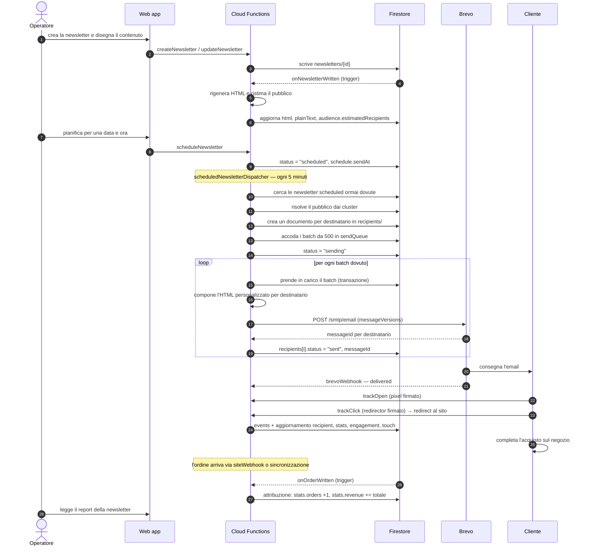
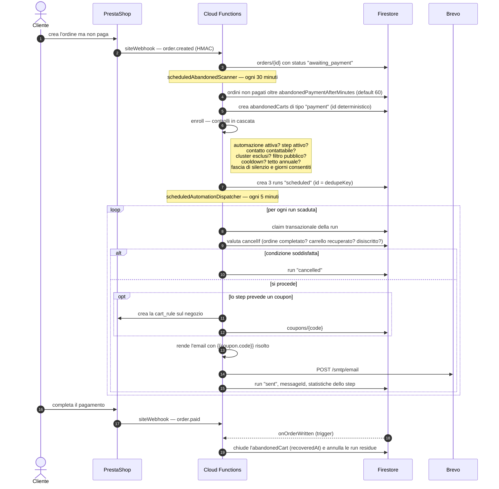

# Architettura

Questo documento descrive come sono organizzati i componenti della AlphaInk Newsletter Suite,
come circolano i dati dal sito a Firestore a Brevo e ritorno, e perché sono state prese certe
decisioni tecniche.

---

## 1. Componenti

| Componente | Tecnologia | Ruolo |
| --- | --- | --- |
| `packages/shared` | TypeScript + zod | Tipi, costanti, schemi di validazione e utility condivise fra web app e Functions. È l'unica fonte di verità per i nomi delle collezioni, gli stati, i default e le regole di classificazione. |
| `apps/web` | Next.js 15 (App Router), React 19, Tailwind 3.4 | Interfaccia operativa. Legge Firestore in tempo reale per le liste e invoca le callable per ogni scrittura non banale. |
| `functions` | Firebase Functions v2, Node 20 | Tutta la logica di dominio: sincronizzazione, rendering, invio, automazioni, tracciamento, attribuzione, metriche. |
| Firestore | — | Archivio documentale. Date come stringhe ISO-8601. |
| Cloud Storage | — | Immagini delle newsletter (lettura pubblica) ed esportazioni. |
| Firebase Auth | — | Identità. Il ruolo viaggia nei **custom claim**, che solo l'Admin SDK può scrivere. |
| Brevo | API v3 via `fetch` | Consegna delle email e sorgente degli eventi di recapito. |
| PrestaShop ×2 | Webservice o MySQL in sola lettura | Clienti, ordini, carrelli, prodotti, categorie, gruppi, buoni sconto. |

Tutte le risorse Firebase vivono in `europe-west1`, dichiarato una sola volta in
`functions/src/lib/config.ts:14` e riusato dai preset `LIGHT_RUNTIME`, `HEAVY_RUNTIME` e
`WEBHOOK_RUNTIME`.

---

## 2. Il flusso dei dati, dall'inizio alla fine

### 2.1 Dal sito a Firestore

Ci sono due strade, complementari.

**Strada lenta ma completa — la sincronizzazione.**
`scheduledSiteSync` gira ogni ora (`functions/src/sync/scheduled.ts:33`) e, per ogni negozio
abilitato, avvia un job dell'orchestratore. Lo stesso job si può lanciare a mano dalla UI con la
callable `runSiteSync`. L'orchestratore (`functions/src/sync/orchestrator.ts`):

1. legge `settings/site` e costruisce un `SiteAdapter` per il negozio richiesto
   (`getAdapter` in `functions/src/sync/prestashop.ts:250`);
2. esegue le entità nell'ordine `customer_groups → categories → customers → orders → carts →
   products → coupons` (`ENTITY_ORDER`), perché le tabelle di supporto arricchiscono le righe
   successive;
3. legge a pagine con cursore keyset, normalizza e scrive su Firestore in modo idempotente;
4. salva cursore e contatori sul documento `syncJobs` **ad ogni pagina**, così un job interrotto
   dal budget di tempo riprende esattamente da dove si era fermato.

L'incrementale riparte da `lastSyncAt − 15 minuti` (`SYNC_OVERLAP_MINUTES`): gli orologi del
negozio e delle Functions non sono allineati al secondo, e rileggere qualche record è innocuo
perché tutte le scritture sono idempotenti.

**Strada veloce ma parziale — il webhook.**
Il negozio può inviare eventi in tempo reale a `siteWebhook` (`functions/src/sync/webhook.ts`),
firmati in HMAC-SHA256 con `SITE_WEBHOOK_SECRET`. È ciò che rende immediate le automazioni
"pagamento abbandonato" e "carrello abbandonato": senza webhook bisognerebbe aspettare la
sincronizzazione oraria. Eventi accettati: `order.created`, `order.updated`, `order.paid`,
`cart.updated`, `customer.created`, `customer.updated`.

Entrambe le strade convergono sulle stesse funzioni di normalizzazione (`sync/normalize.ts`) e
sullo stesso repository (`sync/repository.ts`), quindi producono documenti identici.

**Deduplica.** Un cliente presente su entrambi i negozi resta **un solo** documento `contacts`,
identificato dall'email normalizzata; `sources` ed `externalIds` accumulano le provenienze.

### 2.2 Da Firestore a Brevo

L'invio non usa le campagne Brevo ma il canale **transazionale** (`POST /smtp/email`). La ragione
è scritta in `functions/src/newsletters/sender.ts:28`: una campagna manda lo stesso HTML a una
lista, mentre qui serve un HTML diverso per ogni destinatario — merge tag risolti da noi, link di
disiscrizione firmato, redirector con l'id del contatto.

Il percorso di una spedizione:

```
dispatchNewsletter
  ├─ risolve il pubblico (cluster inclusi/esclusi, contatti singoli, soppressioni)
  ├─ scrive un documento per destinatario in newsletters/{id}/recipients (id = contactId)
  └─ spezza il pubblico in batch da 500 e li accoda in sendQueue

processSendBatch  (ogni 5 minuti, dal dispatcher)
  ├─ prende in carico il batch in transazione
  ├─ compone un'email personalizzata per destinatario
  ├─ la spedisce a blocchi con sendTransactionalBatch
  └─ salva messageId e stato di ogni destinatario
```

La pipeline di rendering (`functions/src/render/pipeline.ts`) ha un ordine obbligato:

```
validazione → HTML dei blocchi → merge tag → riscrittura link (UTM + redirector firmato)
→ pixel di apertura → inlining del CSS → versione testuale
```

I merge tag vanno risolti **prima** della riscrittura dei link, altrimenti si firmerebbe un URL
che è ancora un token; il pixel va inserito **prima** dell'inlining, così riceve i propri stili.

### 2.3 Da Brevo a Firestore

Ogni evento di Brevo (accettazione, consegna, apertura, click, bounce, spam, disiscrizione)
arriva a `brevoWebhook` (`functions/src/tracking/webhook.ts`). L'endpoint:

1. verifica il segreto — `?token=<BREVO_WEBHOOK_SECRET>` in query string, perché Brevo non
   permette header personalizzati, oppure firma HMAC in `X-Alphaink-Signature`;
2. normalizza il payload (Brevo invia un oggetto, un array o `{ events: [...] }` a seconda del
   piano) e lo salva in `events` con id = hash di deduplica, così un ritentativo non conta due
   volte la stessa apertura;
3. risponde `200` subito e prosegue l'elaborazione con un budget di 45 secondi; quello che resta
   indietro viene ripreso da `scheduledStatsReconcile`.

`processEvent` (`functions/src/tracking/processor.ts`) risale al destinatario in quest'ordine:

1. gli id già presenti nell'evento (li scriviamo noi nell'header `X-Mailin-custom` al momento
   dell'invio: è la via più affidabile);
2. il `messageId` cercato nel collection group `recipients`;
3. il `messageId` cercato nel collection group `runs` (automazioni);
4. email + finestra temporale di 30 giorni, come ultima spiaggia.

Poi aggiorna, **in un'unica transazione**: il destinatario, le statistiche aggregate della
newsletter (o dell'automazione e del singolo step) con `FieldValue.increment`, e l'engagement del
contatto. Se qualcosa fallisce l'evento resta `processed: false` e lo riprende la riconciliazione
oraria.

### 2.4 Il ritorno commerciale

Ogni click e la prima apertura generano un `AttributionTouch`. Quando dal sito arriva un ordine,
`onOrderWritten` esegue anche l'attribuzione (`functions/src/tracking/attribution.ts`): cerca i
tocchi del contatto nelle finestre configurate e assegna il fatturato secondo il modello scelto.
Un tocco già attribuito a un ordine non viene riusato, così due acquisti ravvicinati non
raddoppiano il merito della stessa email.

---

## 3. Diagramma di sequenza — invio di una newsletter



---

## 4. Diagramma di sequenza — automazione "Pagamento Abbandonato"



Il flusso delle altre automazioni è lo stesso: cambia solo chi crea le run — il trigger Firestore
`onOrderWritten` per "Coupon Stampante", lo scanner giornaliero
`scheduledRepurchaseScanner` per i due riacquisti, `onContactWritten` per il benvenuto.

---

## 5. Le funzioni, per tipologia

### Callable (`onCall`) — invocate dalla web app

| Gruppo | Funzioni |
| --- | --- |
| Newsletter | `createNewsletter`, `updateNewsletter`, `duplicateNewsletter`, `deleteNewsletter`, `archiveNewsletter`, `scheduleNewsletter`, `cancelNewsletterSchedule`, `sendNewsletterNow`, `pauseNewsletter`, `resumeNewsletter`, `sendTestEmail`, `renderNewsletterPreview`, `estimateAudience` |
| Cluster | `previewCluster`, `saveCluster`, `deleteCluster`, `recomputeCluster` |
| Contatti | `upsertContact`, `deleteContact`, `importContacts`, `exportContacts`, `unsubscribeContact` |
| Sito | `runSiteSync`, `cancelSiteSync`, `saveSiteSettings` |
| Automazioni | `saveAutomation`, `toggleAutomation`, `sendAutomationTest`, `previewAutomationStep`, `resetAutomationToDefaults` |
| Brevo | `saveBrevoSettings`, `testBrevoConnection`, `registerBrevoWebhooks` |
| Impostazioni | `saveTrackingSettings`, `saveBrandingSettings` |
| Utenti | `setUserRole`, `listUsers`, `bootstrapUser` |
| Report | `getDashboardMetrics`, `getNewsletterReport`, `getAutomationReport`, `getCalendarEntries` |
| Media | `requestMediaUpload`, `deleteMediaAsset` |
| Installazione | `seedDefaults` |

Ogni callable valida l'input con zod, verifica il permesso con `requirePermission` e restituisce
direttamente l'oggetto risultato (non incapsulato in `{ok, data}`): gli errori viaggiano come
`HttpsError`, che il client Firebase gestisce già.

### HTTP (`onRequest`) — chiamate dall'esterno

| Funzione | Chi la chiama | Autenticazione |
| --- | --- | --- |
| `brevoWebhook` | Brevo | `?token=` oppure HMAC in `X-Alphaink-Signature` |
| `siteWebhook` | I due PrestaShop | HMAC-SHA256 del corpo grezzo in `X-Alphaink-Signature` |
| `trackClick` | Il client di posta del cliente | Firma HMAC in query (`s=`) |
| `trackOpen` | Il client di posta del cliente | Firma HMAC in query (`s=`) |
| `unsubscribePage` | Il cliente | Token firmato nel percorso o in `?t=` |
| `preferencesPage` | Il cliente | Token firmato |
| `webviewPage` | Il cliente ("vedi nel browser") | Firma HMAC in query |

Girano tutte con `WEBHOOK_RUNTIME`, che imposta `invoker: 'public'`: devono essere raggiungibili
senza autenticazione IAM.

### Programmate (`onSchedule`)

| Funzione | Cadenza | Cosa fa |
| --- | --- | --- |
| `scheduledNewsletterDispatcher` | ogni 5 min | Avvia le newsletter dovute e lavora i batch della coda |
| `scheduledAutomationDispatcher` | ogni 5 min | Spedisce le run di automazione scadute |
| `scheduledSiteSync` | ogni ora | Sincronizzazione incrementale dei negozi abilitati |
| `scheduledClusterRefresh` | ogni 6 ore | Ricalcola i cluster dinamici con `autoRefresh` |
| `scheduledRepurchaseScanner` | ogni giorno 09:00 | Arruola chi è in scadenza di riacquisto |
| `scheduledAbandonedScanner` | ogni 30 min | Trasforma gli ordini non pagati in carrelli abbandonati e arruola |
| `scheduledDailyMetrics` | ogni giorno 02:00 | Consolida gli eventi del giorno in `metricsDaily/{YYYY-MM-DD}` |
| `scheduledStatsReconcile` | ogni ora | Riprende gli eventi non elaborati e ricalcola le statistiche delle ultime 48 ore |

Tutte usano `timeZone: Europe/Rome`.

### Trigger Firestore

| Funzione | Documento | Cosa fa |
| --- | --- | --- |
| `onNewsletterWritten` | `newsletters/{id}` | Rigenera HTML e testo, ristima il pubblico |
| `onContactWritten` | `contacts/{id}` | Allinea Brevo e l'indice dei cluster, valuta il benvenuto |
| `onOrderWritten` | `orders/{id}` | Arruola nelle automazioni **e** esegue l'attribuzione — un solo trigger invece di due |

---

## 6. Scelte tecniche e loro motivazione

### Perché il canale transazionale e non le campagne Brevo
Le campagne inviano lo stesso HTML a una lista Brevo. Qui ogni destinatario riceve un HTML
diverso: merge tag risolti lato nostro, link di disiscrizione firmato con il suo id, redirector
che conosce già il contatto. Solo `POST /smtp/email` lo permette. Il costo è che la sorgente della
verità sulle statistiche siamo noi, non Brevo — da cui la riconciliazione oraria.

### Perché due backend PrestaShop invece di uno
Il **Webservice** è l'API ufficiale, non richiede accesso al database ed è l'unica strada per
*scrivere* (i buoni sconto). Ma serve una richiesta HTTP per pagina e una per ogni risorsa figlia:
su volumi come quelli di AlphaInk un backfill completo richiederebbe ore.
Il backend **MySQL in sola lettura** fa lo stesso lavoro in secondi. I due backend parlano lo
stesso linguaggio intermedio (`Ps*Row`) e condividono la normalizzazione, quindi la modalità si
cambia da UI senza effetti collaterali. Le scritture passano comunque sempre dal Webservice
(`functions/src/sync/prestashop.ts:10`).

### Perché la mappa degli stati ordine è configurabile
In PrestaShop gli id degli stati sono personalizzabili e ogni installazione ne aggiunge di propri.
Cablarli nel codice significherebbe una modifica al software ad ogni stato nuovo.
`DEFAULT_PRESTASHOP_ORDER_STATES` è solo il punto di partenza; la mappa vera vive in
`settings/site` ed è modificabile da Impostazioni → Sito. Uno stato non mappato diventa `pending`,
**mai** `paid`: meglio sottostimare le vendite che attribuire fatturato a una newsletter per un
ordine mai incassato.

### Perché le date sono stringhe ISO e non Timestamp
Una stringa ISO-8601 è ordinabile lessicograficamente (quindi indicizzabile e confrontabile con
`>=` / `<=` in Firestore), attraversa senza perdite il confine server/client di Next.js e
sopravvive alla serializzazione JSON dei webhook e delle callable. I `Timestamp` avrebbero
richiesto conversioni a ogni passaggio.

### Perché la deduplica si basa sull'id del documento
Le Cloud Functions possono essere ritentate in qualsiasi momento e due istanze possono lavorare
in parallelo. Invece di leggere-poi-scrivere (che ha una finestra di corsa), gli id sono
deterministici: la `dedupeKey` **è** l'id della run di automazione, il batch di invio è
`<newsletterId>_<indice>`, l'evento di tracciamento è l'hash del payload, il destinatario è il
`contactId`. Due scritture concorrenti collidono dentro Firestore e la seconda diventa un
aggiornamento innocuo.

### Perché il ruolo sta nei custom claim
Le regole Firestore devono decidere senza fare letture aggiuntive: leggere `users/{uid}` ad ogni
`allow read` costerebbe una lettura per ogni documento valutato. Il claim viaggia dentro il token
ed è gratis da leggere in `request.auth.token.role`. Solo l'Admin SDK può scriverlo, quindi le
regole vietano al client di toccare i campi `role` e `disabled`.

### Perché il tracciamento dei click è nostro e non solo di Brevo
Gli eventi di click di Brevo arrivano con ritardo variabile, non coprono in modo uniforme gli
invii transazionali e non portano l'id del nostro contatto. Il redirector firmato registra il
click nell'istante in cui avviene e sa già a chi appartiene. La firma HMAC sul payload `u|r|c`
impedisce di fabbricare click e, soprattutto, di usare il dominio come open redirect.

### Perché una firma non valida non blocca il redirect
Un link può arrivare con la query troncata (inoltro dell'email, client che riscrive gli URL) o con
una chiave nel frattempo ruotata. Trasformare quel caso in una pagina d'errore per il cliente
sarebbe un danno commerciale peggiore del dato perso: si reindirizza comunque, senza registrare
nulla, e si logga l'anomalia (`functions/src/tracking/redirect.ts:16`).

### Perché i job lavorano a budget di tempo
Le Functions hanno un timeout massimo di 540 secondi. Ogni job pesante (sincronizzazione,
dispatcher, scanner) si dà un budget inferiore, salva lo stato e si chiude in modo pulito quando
il budget scade. La corsa successiva riprende: un backfill di centinaia di migliaia di ordini si
completa in più passaggi senza intervento manuale.

### Perché le automazioni nascono spente
`buildDefaultAutomations` crea le automazioni con `enabled: false`
(`functions/src/automations/defaults.ts:474`). Prima del primo invio reale servono un mittente
verificato su Brevo e una revisione dei testi da parte di AlphaInk. Si attivano dalla UI con
`toggleAutomation`; `resetAutomationToDefaults` non le rispegne.

### Perché il coupon si emette prima dell'invio
Se la politica dello step prevede un buono e l'emissione fallisce, l'email **non parte**. Un
messaggio con un codice inesistente costa più di un messaggio non inviato: genera contatti
all'assistenza e brucia fiducia.

---

## 7. Limiti noti

1. **I percorsi pubblici vanno instradati verso le Functions.**
   L'HTML delle email contiene link costruiti su `APP_URL`: `{APP_URL}/t/c`, `{APP_URL}/t/o`,
   `{APP_URL}/u/<token>`, `{APP_URL}/p/<token>`, `{APP_URL}/w`. Le funzioni corrispondenti
   (`trackClick`, `trackOpen`, `unsubscribePage`, `preferencesPage`, `webviewPage`) sono
   raggiungibili all'endpoint standard delle Cloud Functions. Perché i link funzionino occorre
   **o** puntare `APP_URL` a un dominio con le riscritture verso quelle funzioni, **o** aggiungere
   le riscritture in `firebase.json`. Il codice non le configura da solo: verifica sempre i link
   con un invio di prova prima della prima campagna reale (vedi `docs/SETUP.md`, §9).

2. **Le statistiche non sono immediate.** Gli eventi Brevo arrivano in modo asincrono e
   l'elaborazione post-risposta ha un budget di 45 secondi. Un report letto pochi minuti dopo
   l'invio è ancora parziale; la riconciliazione oraria e il consolidamento notturno lo
   completano. La finestra di riconciliazione è di 48 ore: gli eventi che arrivassero più tardi
   non vengono ripresi automaticamente.

3. **Le aperture non sono un dato affidabile.** Apple Mail Privacy Protection precarica le
   immagini, quindi il pixel viene richiesto anche se il cliente non ha mai aperto il messaggio.
   Il sistema riconosce le aperture proxy e le classifica come `proxy_open`, escludendole
   dall'open rate quando `settings/tracking.excludeProxyOpens` è attivo, ma il riconoscimento è
   euristico (user agent e IP). Il click resta la metrica solida.

4. **L'attribuzione è probabilistica, tranne il coupon.** Un acquisto attribuito con `last_click`
   non prova che la newsletter abbia causato l'ordine. Solo il coupon è deterministico, ed è per
   questo che `couponOverridesModel` è attivo per default.

5. **Il rate limit di Brevo è per istanza.** Il `RateLimiter` del client è tarato a 10 richieste/s
   con burst 20, ma vive nel processo: il tetto reale è `maxInstances × 10 req/s`. Le funzioni che
   spingono volumi alti tengono `maxInstances` basso apposta; alzarlo può far scattare i `429` di
   Brevo (`functions/src/brevo/client.ts:17`).

6. **MySQL richiede raggiungibilità di rete.** Perché una Cloud Function raggiunga il database del
   negozio, l'host deve essere pubblicamente accessibile con l'IP autorizzato, oppure la funzione
   deve uscire da un connettore VPC. Il codice non configura il connettore.

7. **Nessuna collezione `products`.** Il catalogo viene letto durante la sincronizzazione per
   arricchire righe ordine e carrelli e per verificare la classificazione per famiglia, ma vive
   solo in memoria durante il job: le regole di sicurezza non prevedono una collezione dedicata
   (`functions/src/sync/types.ts:81`).

8. **`compleanno_cliente` non ha contenuti predefiniti.** La chiave esiste in `AUTOMATION_KEYS` e
   l'automazione è configurabile, ma `buildDefaultAutomations` non la installa: va creata a mano
   se serve (`DEFAULT_AUTOMATION_KEYS` in `functions/src/automations/defaults.ts`).

9. **Le credenziali salvate da UI potrebbero non entrare subito in servizio.** Il salvataggio
   scrive una nuova versione del secret in Secret Manager, ma le istanze già avviate continuano a
   usare la versione precedente fino al ricambio. Se il permesso `secretmanager.versions.add`
   manca, il salvataggio non fallisce: restituisce il motivo e suggerisce il comando
   `firebase functions:secrets:set`.

10. **Solo un `seedDefaults` è idempotente, non un downgrade.** Il seed aggiunge le chiavi mancanti
    ai documenti `settings` esistenti ma non rimuove né corregge quelle già presenti: dopo un
    aggiornamento che cambia il *significato* di un'impostazione, la correzione è manuale.
