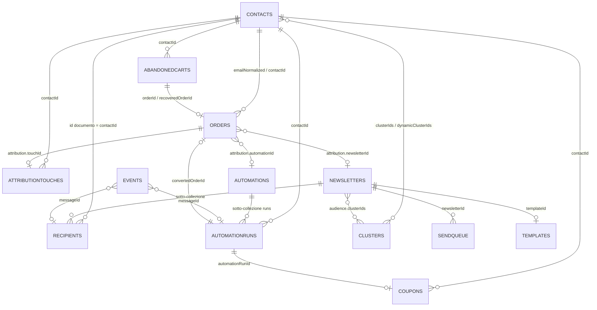

# Modello dati

Tutti i dati vivono su **Cloud Firestore**. I nomi delle collezioni sono definiti una sola volta in
`packages/shared/src/constants/collections.ts` (costante `COLLECTIONS`): web app e Cloud Functions
leggono da lì, mai da stringhe letterali.

> **Convenzione sulle date.** Nei documenti Firestore le date sono **stringhe ISO-8601**
> (`2026-09-02T10:15:00.000Z`), non `Timestamp`. Sono ordinabili lessicograficamente — quindi
> indicizzabili e confrontabili con `>=` / `<=` — attraversano senza perdite il confine
> server/client di Next.js e sopravvivono alla serializzazione JSON di webhook e callable.

> **Campi di audit.** Quasi tutti i documenti estendono `AuditFields`:
> `createdAt`, `updatedAt`, `createdBy`, `updatedBy`.

---

## 1. Mappa delle collezioni

| Collezione | Id documento | Contenuto | Scritta da |
| --- | --- | --- | --- |
| `users` | uid Firebase Auth | Profilo e ruolo | Functions |
| `contacts` | generato | Anagrafica clienti unificata B2C + B2B | Functions (sync, import) e admin da UI |
| `clusters` | generato | Segmenti di pubblico | UI (editor+) |
| `newsletters` | generato | Campagne | UI (editor+) e Functions |
| `newsletters/{id}/recipients` | `contactId` | Un documento per destinatario | Solo Functions |
| `templates` | generato / id di sistema | Modelli di email | UI (editor+) |
| `automations` | generato | Flussi automatici | UI (admin+) |
| `automations/{id}/runs` | `dedupeKey` | Singole esecuzioni programmate | Solo Functions |
| `orders` | `{sorgente}_{idEsterno}` | Ordini dai negozi | Solo Functions |
| `abandonedCarts` | deterministico | Carrelli e pagamenti abbandonati | Solo Functions |
| `coupons` | generato | Buoni emessi dalle automazioni | Solo Functions |
| `events` | hash di deduplica | Eventi di tracciamento grezzi | Solo Functions |
| `attributionTouches` | generato | Aperture e click attribuibili | Solo Functions |
| `syncJobs` | `{sorgente}_{istante}` | Esecuzioni di sincronizzazione | Solo Functions |
| `sendQueue` | `{newsletterId}_{indice}` | Batch della coda di invio | Solo Functions |
| `mediaAssets` | generato | Libreria immagini | UI (editor+) |
| `settings` | `brevo` · `site` · `branding` · `tracking` | Configurazione | UI (admin+) |
| `activityLog` | generato | Registro delle operazioni | Solo Functions |
| `metricsDaily` | `YYYY-MM-DD` | Consolidamento giornaliero | Solo Functions |

---

## 2. Relazioni



Il perno di tutto è **`contacts`**, e la chiave di collegamento è l'**email normalizzata**
(minuscola, senza spazi). Un cliente presente su entrambi i negozi resta un solo documento, con
`sources` ed `externalIds` che accumulano le provenienze.

---

## 3. Le collezioni in dettaglio

### 3.1 `users`

Id del documento = **uid di Firebase Auth**.

| Campo | Tipo | Note |
| --- | --- | --- |
| `email` | string | Minuscola |
| `displayName` | string | |
| `photoURL` | string \| null | |
| `role` | `owner` \| `admin` \| `editor` \| `analyst` \| `viewer` | Duplicato nei **custom claim** del token |
| `disabled` | boolean | Utente sospeso |
| `lastLoginAt` | IsoDate \| null | |

Il ruolo effettivo per le regole di sicurezza è quello nel **custom claim**, non quello nel
documento: `setUserRole` aggiorna entrambi e le regole vietano al client di toccare `role`,
`disabled` e `createdAt`.

### 3.2 `contacts`

| Gruppo | Campi |
| --- | --- |
| Identità | `email`, `emailNormalized`, `firstName`, `lastName`, `displayName`, `phone`, `company`, `vatNumber` |
| Provenienza | `source` (principale), `sources[]` (tutte), `externalIds` (id cliente per sorgente) |
| Iscrizione | `status`, `optInAt`, `optOutAt`, `consentSource` |
| Geografia | `language`, `country`, `province`, `city`, `postcode` |
| Segmentazione | `customerGroup`, `segment` (`b2c`/`b2b`), `tags[]`, `clusterIds[]`, `dynamicClusterIds[]` |
| Commerciale | `stats` (vedi sotto) |
| Email | `engagement` (vedi sotto) |
| Prodotto | `printers[]`: marca, modello, come è stato dedotto, SKU compatibili |
| Brevo | `brevoContactId`, `brevoSyncedAt`, `brevoListIds[]` |
| Altro | `lastSyncAt`, `customAttributes`, `notes` |

`status` (`SubscriptionStatus`): `subscribed`, `unsubscribed`, `pending`, `bounced`, `blocked`,
`never_subscribed`. Solo gli stati in `SENDABLE_STATUSES` ricevono email.

**`stats`** — aggiornato dopo ogni ordine:

`ordersCount`, `totalSpent`, `averageOrderValue`, `firstOrderAt`, `lastOrderAt`,
`averageDaysBetweenOrders`, `nextPurchaseDueAt` (per famiglia), `spentByFamily`, `ordersByFamily`,
`lastOrderByFamily`.

`stats.nextPurchaseDueAt.<famiglia>` è il campo su cui lo scanner giornaliero seleziona chi
arruolare nelle automazioni di riacquisto.

**`engagement`** — aggiornato dagli eventi di tracciamento:

`sent`, `delivered`, `opened`, `clicked`, `bounced`, `complaints`, `lastSentAt`, `lastOpenedAt`,
`lastClickedAt`, `engagementScore` (0-100), `engagementTier` (`hot`, `warm`, `cold`, `dormant`,
`unknown`).

Il punteggio combina recency e frequenza di aperture e click (`computeEngagementScore`); la fascia
ne deriva ed è usata dai cluster automatici e per il riscaldamento del dominio.

**Due liste di cluster, non una.** `clusterIds` sono le appartenenze **statiche**, assegnate a
mano; `dynamicClusterIds` sono quelle **calcolate** dal motore. Tenerle separate permette al
ricalcolo di riscrivere le seconde senza distruggere le prime.

### 3.3 `clusters`

| Campo | Note |
| --- | --- |
| `name`, `description`, `color`, `icon` | Presentazione |
| `type` | `dynamic` (regole) · `static` (elenco fisso) · `site_group` (gruppo PrestaShop) · `brevo_list` |
| `rules` | Albero `FilterGroup` ricorsivo, solo per `dynamic` |
| `contactIds[]` | Solo per `static` |
| `siteGroupName` / `brevoListId` | Per i tipi corrispondenti |
| `contactCount`, `sendableCount` | Esito dell'ultimo ricalcolo |
| `lastComputedAt`, `computeDurationMs`, `computeError` | Diagnostica |
| `autoRefresh` | Se ricalcolarlo con il job periodico |
| `syncToBrevo`, `brevoSyncedAt` | Crea/aggiorna la lista corrispondente su Brevo |
| `archived` | Nascosto dalle liste |

Le regole sono un albero: ogni `FilterGroup` ha un combinatore `and`/`or`, un elenco di condizioni,
gruppi annidati e un eventuale `negate`. I campi filtrabili coprono anagrafica, dati commerciali
(anche `purchasedFamily`, `purchasedSku`, `purchasedBrand`, `printerBrand`, `printerModel`) ed
engagement. Gli operatori includono i relativi temporali `within_last_days`, `before_last_days` e
`between`.

### 3.4 `newsletters`

| Gruppo | Campi |
| --- | --- |
| Identità | `name`, `subject`, `preheader`, `fromName`, `fromEmail`, `replyTo` |
| Contenuto | `document` (l'editor a blocchi, **fonte di verità**), `html`, `plainText`, `thumbnailUrl` |
| Stato | `status`, `sentAt`, `startedSendingAt`, `completedAt`, `cancelledAt`, `failureReason`, `sendAttempts` |
| Pubblico | `audience` |
| Pianificazione | `schedule` |
| A/B test | `abTest`, `variants[]` |
| Brevo | `brevoCampaignId`, `brevoListIds[]` |
| Statistiche | `stats` |
| Editoriale | `tags[]`, `color`, `category`, `archived` |
| Origine | `automationKey`, `templateId`, `duplicatedFromId` |

`status` (`NewsletterStatus`): `draft` → `scheduled` → `queued` → `sending` → `sent`, più `paused`,
`failed`, `cancelled`.

`audience` — `clusterIds[]` (unione), `excludeClusterIds[]` (sottrazione, applicata dopo),
`includeContactIds[]`, `excludeContactIds[]`, `suppressIfContactedWithinDays`,
`suppressIfPurchasedWithinDays`, `estimatedRecipients`, `estimatedAt`.

`schedule` — `sendAt` (UTC), `timezone`, `throttle` (`batchSize` + `intervalMinutes`),
`optimizeSendTime`, `quietHours`.

`stats` — `recipients`, `requested`, `delivered`, `softBounces`, `hardBounces`, `blocked`,
`opened`, `uniqueOpened`, `clicked`, `uniqueClicked`, `unsubscribed`, `complaints`, `orders`,
`revenue`, `currency`, più i tassi già calcolati (`deliveryRate`, `openRate`, `clickRate`,
`clickToOpenRate`, `bounceRate`, `unsubscribeRate`, `conversionRate`, `revenuePerRecipient`).

I tassi sono **denormalizzati** apposta: la dashboard e le liste li leggono direttamente, senza
ricalcolarli a ogni rendering.

### 3.5 `newsletters/{id}/recipients`

**Id del documento = `contactId`.** Non è un dettaglio: il modulo di tracciamento cerca il
destinatario proprio così, e questo rende impossibile spedire due volte allo stesso contatto nella
stessa campagna.

| Campo | Note |
| --- | --- |
| `contactId`, `email`, `variantId` | |
| `status` | `pending`, `sent`, `delivered`, `opened`, `clicked`, `converted`, `soft_bounced`, `hard_bounced`, `blocked`, `unsubscribed`, `spam`, `failed` |
| `messageId` | Restituito da Brevo: **chiave di correlazione con i webhook** |
| `sentAt`, `deliveredAt`, `firstOpenedAt`, `lastOpenedAt`, `firstClickedAt` | Cronologia |
| `openCount`, `clickCount` | Contatori |

### 3.6 `templates`

`name`, `description`, `category`, `document`, `thumbnailUrl`, `isSystem`, `usageCount`, `tags[]`.

I cinque template installati da `seedDefaults` hanno `isSystem: true` e non sono eliminabili
(le regole lo vietano esplicitamente).

### 3.7 `automations`

| Gruppo | Campi |
| --- | --- |
| Identità | `key`, `name`, `description`, `isCore` |
| Attivazione | `enabled`, `testMode`, `testRecipients[]` |
| Logica | `trigger` (`TriggerConfig`), `steps[]` (`AutomationStep[]`) |
| Pubblico | `audienceFilter`, `excludeClusterIds[]` |
| Frequenza | `cooldownDays`, `maxPerContactPerYear`, `quietHours`, `allowedWeekdays[]`, `maxSendsPerHour`, `timezone` |
| Mittente | `fromName`, `fromEmail`, `replyTo` |
| Stato | `stats`, `lastRunAt`, `lastErrorAt`, `lastError` |

Ogni `AutomationStep` porta con sé `id`, `name`, `enabled`, `delay`, `subject`, `preheader`,
`document` (o `templateId`), `cancelIf[]`, `coupon` e le proprie `stats`.

### 3.8 `automations/{id}/runs`

**Id del documento = `dedupeKey`**, nel formato
`{automationKey}:{stepId}:{contactId}:{sourceEntityId}`. È il meccanismo di idempotenza:
due arruolamenti dallo stesso trigger collidono dentro Firestore anche se partono in parallelo.

| Campo | Note |
| --- | --- |
| `automationId`, `automationKey`, `stepId`, `contactId`, `email` | Riferimenti |
| `sourceType` | `order` · `cart` · `contact` · `schedule` |
| `sourceId` | Id dell'entità che ha generato il trigger |
| `status` | `scheduled` · `sent` · `cancelled` · `skipped` · `failed` |
| `scheduledFor` | Quando deve partire |
| `processedAt` | Marcatore del claim transazionale |
| `sentAt`, `messageId` | Esito dell'invio |
| `cancelledReason` | La `CancelCondition`, oppure `manual`, `quiet_hours`, `cooldown`, `not_sendable` |
| `skipReason`, `error` | Diagnostica |
| `couponCode`, `couponExpiresAt` | Buono emesso per questo invio |
| `convertedOrderId`, `revenue` | Attribuzione |
| `context` | Snapshot dei dati di merge (prodotti, stampante, totale carrello) |

### 3.9 `orders`

**Id del documento = `{sorgente}_{idEsterno}`**, per esempio `prestashop_b2c_12345`: deterministico,
quindi una risincronizzazione aggiorna invece di duplicare.

| Gruppo | Campi |
| --- | --- |
| Identità | `externalId`, `source`, `orderNumber`, `email`, `emailNormalized`, `contactId` |
| Stato | `status` (normalizzato), `rawStatus` (etichetta del negozio) |
| Importi | `total`, `subtotal`, `shipping`, `tax`, `currency`, `couponCode`, `refundedAmount` |
| Contenuto | `items[]`, `families[]`, `skus[]` |
| Cronologia | `placedAt`, `paidAt`, `completedAt`, `cancelledAt`, `refundedAt` |
| Marketing | `utm`, `attribution`, `attributions[]` (modello lineare) |
| Sistema | `lastSyncAt` |

`families[]` e `skus[]` sono **denormalizzati** dalle righe: permettono di interrogare gli ordini
con `array-contains` senza leggere `items`, che è un array di oggetti e non sarebbe filtrabile.

### 3.10 `abandonedCarts`

Copre due casi con lo stesso documento, distinti da `kind`:

- `cart` — carrello mai convertito;
- `payment` — ordine creato ma non pagato (in quel caso `orderId` punta all'ordine).

`externalId`, `source`, `email`, `emailNormalized`, `contactId`, `total`, `currency`, `items[]`,
`recoveryUrl`, `abandonedAt`, `lastSeenAt`, `remindersSent`, `lastReminderAt`, `recoveredAt`,
`recoveredOrderId`, `recoveredRevenue`, `closedAt`, `closedReason`.

### 3.11 `coupons`

`code`, `automationId`, `automationRunId`, `newsletterId`, `contactId`, `email`, `discountType`,
`discountValue`, `minOrderTotal`, `restrictToSkus[]`, `restrictToFamilies[]`, `issuedAt`,
`expiresAt`, `siteCouponId` (l'`id_cart_rule` su PrestaShop), `siteSyncError`, `redeemedAt`,
`redeemedOrderId`, `redeemedAmount`.

`siteCouponId` vuoto con `siteSyncError` valorizzato significa: codice emesso e spedito, ma la
`cart_rule` non è stata creata sul negozio. Va creata a mano, altrimenti il cliente non può
spenderlo.

### 3.12 `events`

**Id del documento = hash di deduplica del payload**: una consegna ripetuta del webhook non conta
due volte apertura o click.

| Campo | Note |
| --- | --- |
| `type` | `BrevoEventType` (17 valori, incluso `proxy_open`) |
| `email`, `contactId` | Destinatario |
| `messageId` | Chiave primaria di correlazione |
| `source` | `newsletter` · `automation` · `test` · `transactional` |
| `newsletterId`, `variantId`, `automationId`, `automationRunId`, `brevoCampaignId` | Correlazione applicativa |
| `url`, `reason`, `tag` | Dettagli dell'evento |
| `ip`, `userAgent`, `device`, `os`, `emailClient` | Contesto tecnico |
| `occurredAt`, `receivedAt` | Istante dichiarato da Brevo e istante di ricezione |
| `raw` | Payload originale, per debug e riprocessamento |
| `dedupeHash` | |
| `processed` | `false` finché l'elaborazione non è andata a buon fine |

`processed: false` è la coda di lavoro di `scheduledStatsReconcile`.

### 3.13 `attributionTouches`

`contactId`, `email`, `source`, `newsletterId`, `automationId`, `automationRunId`, `variantId`,
`touchType` (`open` \| `click`), `url`, `occurredAt`, `attributedOrderId`.

`attributedOrderId` marca il tocco come **consumato**: non verrà riusato per un altro ordine, così
due acquisti ravvicinati non raddoppiano il merito della stessa email.

### 3.14 `syncJobs`

`source`, `entities[]`, `status` (`queued`, `running`, `success`, `partial`, `failed`,
`cancelled`), `trigger` (`manual`, `schedule`, `webhook`, `backfill`), `since`, `cursor`,
`counts` (per entità: `fetched`, `created`, `updated`, `skipped`, `failed`), `startedAt`,
`finishedAt`, `durationMs`, `error`, `warnings[]`, `requestedBy`.

Lo stato `partial` con `cursor` valorizzato significa "interrotto per budget di tempo, riprenderà
da qui": è normale sui backfill grandi, non è un errore.

### 3.15 `sendQueue`

**Id del documento = `{newsletterId}_{indice a 5 cifre}`**: ri-accodare lo stesso batch non crea
duplicati.

`newsletterId`, `index`, `total`, `status` (`pending`, `processing`, `sent`, `failed`, `paused`,
`cancelled`), `runAt`, `contactIds[]` (max 500), `size`, `sent`, `failed`, `skipped`, `attempts`,
`claimedAt`, `completedAt`, `error`.

Il tetto di 500 contatti tiene il documento ben sotto il limite di 1 MB di Firestore e mantiene
ogni batch lavorabile in meno di un paio di minuti al ritmo consentito da Brevo.

### 3.16 `metricsDaily`

**Id del documento = `YYYY-MM-DD`** nel giorno **locale** `Europe/Rome`: un invio delle 23:30 e le
sue aperture delle 00:10 finiscono in due giorni diversi, come si aspetta chi legge il grafico.

| Campo | Note |
| --- | --- |
| `day`, `timezone`, `from`, `to` | Intervallo consolidato |
| `channels.newsletter` / `.automation` / `.total` | Metriche per canale |
| `store` | Ordini e fatturato del giorno, **indipendentemente** dall'attribuzione |
| `emailRevenueShare` | Quota di fatturato attribuita alle email (0-1) |
| `eventsScanned`, `ordersScanned` | Volumi elaborati |
| `partial` | Il giorno non è concluso: i valori cambieranno |
| `truncated` | Raggiunti i tetti di sicurezza (300.000 eventi, 50.000 ordini): i numeri sono per difetto |
| `computedAt` | |

Ogni blocco `ChannelMetrics` contiene `sent`, `delivered`, `opened`, `uniqueOpened`, `proxyOpened`,
`clicked`, `uniqueClicked`, `softBounces`, `hardBounces`, `blocked`, `complaints`, `unsubscribed`,
`orders`, `revenue`.

Il consolidamento esiste perché senza di esso ogni apertura della dashboard rileggerebbe centinaia
di migliaia di eventi.

### 3.17 `settings`

Quattro documenti a id fisso.

| Documento | Contenuto |
| --- | --- |
| `brevo` | `apiKeyConfigured`, `apiKeyHint`, dati account, crediti, `senders[]`, `defaultSenderEmail`, `defaultReplyTo`, `webhooks[]`, `webhookSecretConfigured`, `syncContacts`, `defaultListId`, `attributeMapping`, `maxSendsPerHour`, `lastCheckedAt`, `lastError` |
| `site` | `stores` (uno per sorgente), `syncSchedule`, `familyRules[]`, `repurchaseCycleDays`, `abandonedPaymentAfterMinutes`, `abandonedCartAfterMinutes`, `webhookSecretConfigured`, `defaultSource` |
| `branding` | Nome, ragione sociale, indirizzo, P.IVA, contatti, loghi, `palette`, `fonts`, `socialLinks[]`, `legalFooterHtml`, `unsubscribeText` |
| `tracking` | `attribution`, `autoUtm`, `utmSource`, `utmMedium`, `utmCampaignTemplate`, `useOwnClickTracking`, `clickTrackingDomain`, `excludeProxyOpens` |

Ogni `PrestaShopStoreSettings` contiene: `source`, `label`, `enabled`, `baseUrl`, `mode`,
`credentialsConfigured`, `multistoreShopId`, `tablePrefix`, `defaultSegment`,
`customerGroupMapping`, `orderStateMapping`, `languageId`, `lastSyncAt`, `lastSyncError`.

> **Nessuna credenziale è mai memorizzata qui.** Chiavi Webservice, password MySQL e chiave Brevo
> vivono in Secret Manager; su Firestore restano solo indicatori come `credentialsConfigured` e
> `apiKeyHint`. Se un patch contiene per errore `wsKey` o `dbPassword`, viene scartato e l'evento
> loggato (`functions/src/sync/settings.ts:107`).

### 3.18 `mediaAssets` e `activityLog`

**`mediaAssets`** — metadati delle immagini: percorso su Storage, URL pubblico, `folder`, nome,
tipo, dimensioni, autore. I file stanno in `media/{anno}/{mese}/{idCasuale}-{nome}` con lettura
pubblica, perché i client di posta non sono autenticati.

**`activityLog`** — `action`, `entityType`, `entityId`, `userId`, `summary` (in italiano),
`metadata`, `severity` (`info` \| `warning` \| `error`), `createdAt`. Leggibile solo da `admin` e
superiori.

---

## 4. Indici compositi

Firestore crea da solo gli indici a campo singolo. Servono indici **compositi** quando una query
combina più filtri, oppure un filtro di uguaglianza con un ordinamento su un altro campo.
Sono definiti in `firestore.indexes.json`.

### `newsletters`

| Indice | Query che serve |
| --- | --- |
| `archived` + `status` + `schedule.sendAt` | Calendario editoriale filtrato per stato |
| `status` + `schedule.sendAt` | **Il dispatcher**: newsletter `scheduled` la cui ora è passata. Il più critico di tutti: gira ogni 5 minuti |
| `archived` + `updatedAt ↓` | Elenco newsletter, più recenti in cima |
| `archived` + `category` + `schedule.sendAt` | Calendario filtrato per categoria editoriale |
| `status` + `sentAt ↓` | Ultime newsletter inviate, per dashboard e report |

### `contacts`

| Indice | Query che serve |
| --- | --- |
| `status` + `dynamicClusterIds` (array) + `emailNormalized` | **Risoluzione del pubblico**: chi è nel cluster dinamico X ed è contattabile. L'ordinamento su `emailNormalized` dà una paginazione stabile |
| `status` + `clusterIds` (array) + `emailNormalized` | Come sopra per i cluster statici |
| `segment` + `status` + `stats.totalSpent ↓` | Migliori clienti per segmento B2C/B2B |
| `status` + `engagement.engagementTier` + `engagement.engagementScore ↓` | Cluster e riscaldamento del dominio per fascia di engagement |
| `source` + `updatedAt ↓` | Contatti per provenienza, dopo una sincronizzazione |
| `status` + `stats.lastOrderAt` | Clienti inattivi → automazione win-back |

> Lo scanner di riacquisto interroga `stats.nextPurchaseDueAt.<famiglia>` con un intervallo e un
> `orderBy` sullo **stesso** campo: usa l'indice automatico a campo singolo e non richiede un
> indice composito dedicato — per questo non ne trovi uno per famiglia.

### `orders`

| Indice | Query che serve |
| --- | --- |
| `emailNormalized` + `placedAt ↓` | Storico ordini nella scheda del contatto |
| `status` + `placedAt ↓` | **Scanner dei pagamenti abbandonati**: ordini non pagati nella finestra |
| `contactId` + `families` (array) + `placedAt ↓` | Ultimo acquisto di una famiglia: base dei riacquisti e della condizione `repurchased` |
| `attribution.newsletterId` + `placedAt ↓` | Fatturato attribuito a una newsletter |
| `attribution.automationId` + `placedAt ↓` | Fatturato attribuito a un'automazione |
| `source` + `updatedAt ↓` | Ordini per negozio, per la diagnostica della sincronizzazione |

### `abandonedCarts`

| Indice | Query che serve |
| --- | --- |
| `recoveredAt` + `closedAt` + `abandonedAt` | Scanner: i carrelli **ancora aperti** (né recuperati né chiusi) nella finestra |
| `emailNormalized` + `abandonedAt ↓` | Carrelli nella scheda del contatto |

### `runs` (collection group)

Sono **collection group** perché le run vivono sotto ogni automazione, e il dispatcher deve
vederle tutte insieme.

| Indice | Query che serve |
| --- | --- |
| `status` + `scheduledFor` | **Il dispatcher delle automazioni**: run scadute di qualsiasi automazione |
| `contactId` + `automationKey` + `createdAt ↓` | Verifica di cooldown e tetto annuale |
| `dedupeKey` + `status` | Controllo di duplicazione all'arruolamento |

### `recipients` (collection group)

| Indice | Query che serve |
| --- | --- |
| `messageId` (collection group) | **Correlazione degli eventi Brevo**: dato un `messageId`, trovare il destinatario in qualsiasi newsletter. Senza, ogni evento richiederebbe una scansione |
| `email` + `sentAt ↓` (collection group) | Ripiego per email quando l'evento non porta il `messageId`; cronologia email del contatto |
| `status` + `sentAt ↓` (collezione) | Tabella destinatari di una newsletter, filtrata per stato |

### `events`

| Indice | Query che serve |
| --- | --- |
| `newsletterId` + `type` + `occurredAt ↓` | Report per newsletter: aperture, click, bounce nel tempo |
| `email` + `occurredAt ↓` | Cronologia eventi nella scheda del contatto |
| `processed` + `receivedAt` | **Riconciliazione oraria**: eventi rimasti da elaborare, dal più vecchio |

### Altri

| Collezione | Indice | Query che serve |
| --- | --- | --- |
| `attributionTouches` | `email` + `occurredAt ↓` | Tocchi nella finestra di attribuzione al momento dell'ordine |
| `attributionTouches` | `contactId` + `touchType` + `occurredAt ↓` | Solo i click, o solo le aperture, secondo il modello |
| `coupons` | `code` + `expiresAt` | Ricerca del buono al momento del riscatto, con controllo di validità |
| `sendQueue` | `status` + `runAt` | **Dispatcher delle newsletter**: batch `pending` ormai dovuti |
| `clusters` | `archived` + `autoRefresh` + `lastComputedAt` | Ricalcolo periodico: i cluster non aggiornati da più tempo per primi |
| `mediaAssets` | `folder` + `createdAt ↓` | Libreria immagini, per cartella |

### Esclusioni di indicizzazione (`fieldOverrides`)

Alcuni campi sono **esclusi** dall'indicizzazione automatica. Non è un'ottimizzazione marginale:
Firestore indicizza per default ogni campo, comprese le mappe annidate, e su un campo grande questo
costa spazio, tempo di scrittura e a volte supera i limiti dell'indice.

| Collezione | Campo | Perché |
| --- | --- | --- |
| `events` | `raw` | Payload Brevo completo: mai filtrato, solo letto per debug |
| `orders` | `items` | Array di oggetti; le query usano `families[]` e `skus[]`, che sono denormalizzati apposta |
| `newsletters` | `document` | L'albero dell'editor a blocchi: grande e mai filtrato |
| `newsletters` | `html` | L'HTML compilato, che può superare i 100 KB |
| `templates` | `document` | Come sopra |

---

## 5. Regole di sicurezza per ruolo

Definite in `firestore.rules`. Il ruolo arriva dal **custom claim** del token
(`request.auth.token.role`), non da una lettura di `users/{uid}`: valutarlo non costa letture
aggiuntive.

### 5.1 Gerarchia e permessi

| Ruolo | Rango |
| --- | ---: |
| `owner` | 50 |
| `admin` | 40 |
| `editor` | 30 |
| `analyst` | 20 |
| `viewer` | 10 |

Matrice dei permessi (`ROLE_PERMISSIONS` in `packages/shared/src/types/user.ts`):

| Permesso | viewer | analyst | editor | admin | owner |
| --- | :---: | :---: | :---: | :---: | :---: |
| `newsletter:read` | ✅ | ✅ | ✅ | ✅ | ✅ |
| `newsletter:write` | | | ✅ | ✅ | ✅ |
| `newsletter:schedule` | | | ✅ | ✅ | ✅ |
| `newsletter:send` | | | | ✅ | ✅ |
| `contacts:read` | ✅ | ✅ | ✅ | ✅ | ✅ |
| `contacts:export` | | ✅ | ✅ | ✅ | ✅ |
| `contacts:write` | | | | ✅ | ✅ |
| `clusters:read` | ✅ | ✅ | ✅ | ✅ | ✅ |
| `clusters:write` | | | ✅ | ✅ | ✅ |
| `automations:read` | ✅ | ✅ | ✅ | ✅ | ✅ |
| `automations:write` | | | | ✅ | ✅ |
| `automations:toggle` | | | | ✅ | ✅ |
| `analytics:read` | ✅ | ✅ | ✅ | ✅ | ✅ |
| `media:write` | | | ✅ | ✅ | ✅ |
| `settings:read` | ✅ | ✅ | ✅ | ✅ | ✅ |
| `settings:write` | | | | ✅ | ✅ |
| `sync:run` | | | | ✅ | ✅ |
| `users:manage` | | | | | ✅ |

Differenze da notare:

- **`editor` scrive le newsletter ma non le invia.** Può creare, modificare e pianificare, ma
  `newsletter:send` è da `admin` in su: chi disegna il contenuto non è chi decide di spedirlo a
  decine di migliaia di persone.
- **`analyst` esporta i contatti ma non li modifica.** Legge tutto e porta via i dati per analisi
  esterne senza poter toccare l'anagrafica.
- **`users:manage` è solo dell'`owner`.** Nemmeno un `admin` può cambiare i ruoli.

### 5.2 Regole per collezione

| Collezione | Lettura | Creazione | Modifica | Eliminazione |
| --- | --- | --- | --- | --- |
| `users` | Sé stessi, oppure `admin`+ | mai dal client | Solo il proprio profilo, **escluso** `role`, `disabled`, `createdAt` | mai |
| `contacts` | `viewer`+ | `admin`+ | `admin`+, senza toccare i campi calcolati | `admin`+ |
| `clusters` | `viewer`+ | `editor`+ | `editor`+, senza toccare i campi calcolati | `admin`+ |
| `newsletters` | `viewer`+ | `editor`+ | `editor`+, con vincoli di stato (vedi sotto) | `admin`+, solo se `draft`/`cancelled`/`failed` |
| `newsletters/{id}/recipients` | `viewer`+ | mai | mai | mai |
| `templates` | `viewer`+ | `editor`+ | `editor`+ | `admin`+, solo se `isSystem == false` |
| `automations` | `viewer`+ | `admin`+ | `admin`+, senza toccare i campi calcolati | `owner`, solo se `isCore == false` |
| `automations/{id}/runs` | `viewer`+ | mai | mai | mai |
| `orders`, `abandonedCarts`, `coupons`, `syncJobs`, `metricsDaily` | `viewer`+ | mai | mai | mai |
| `events`, `attributionTouches` | `analyst`+ | mai | mai | mai |
| `sendQueue`, `activityLog` | `admin`+ | mai | mai | mai |
| `mediaAssets` | `viewer`+ | `editor`+ | `editor`+ | `admin`+ |
| `settings/*` | `viewer`+ | `admin`+ | `admin`+ | `admin`+ |
| Qualsiasi altro percorso | negato | negato | negato | negato |

Ogni utente deve inoltre essere **attivo**: il claim `disabled` a `true` blocca qualsiasi accesso.

### 5.3 Le tre protezioni che contano

**a) Nessuna manomissione delle statistiche.**
La funzione `noStatsTampering()` vieta al client di modificare i campi che sono di competenza
esclusiva delle Functions:

```
stats · engagement · brevoCampaignId · brevoContactId ·
contactCount · sendableCount · lastComputedAt
```

Senza questa regola, un `editor` potrebbe riscrivere a mano il fatturato attribuito a una
newsletter.

**b) Lo stato di invio è governato dalle Functions.**
Un client può modificare una newsletter solo se lo stato **attuale** è
`draft`, `scheduled`, `paused`, `failed` o `cancelled`, e solo se lo stato **richiesto** è
`draft`, `scheduled`, `paused` o `cancelled`. Conseguenze:

- una newsletter in `sending` o `queued` non è modificabile: si fermerebbe a metà spedizione;
- nessun client può portare una newsletter a `sending`, `queued` o `sent` — quella transizione
  appartiene al dispatcher.

**c) I dati generati non sono scrivibili dal client.**
Destinatari, run di automazione, ordini, carrelli, coupon, eventi, tocchi, job di
sincronizzazione, coda di invio, registro attività e metriche giornaliere sono in **sola lettura**
per chiunque: solo l'Admin SDK ci scrive.

### 5.4 Regole di Cloud Storage

Definite in `storage.rules`.

| Percorso | Lettura | Scrittura |
| --- | --- | --- |
| `media/**` | **pubblica** | `owner`, `admin`, `editor`; solo immagini; max 8 MB. Eliminazione: `owner`, `admin` |
| `thumbnails/**` | **pubblica** | mai dal client (solo Admin SDK) |
| `imports/**` | `owner`, `admin` | `owner`, `admin`; max 8 MB |
| `exports/**` | `owner`, `admin`, `analyst` | mai dal client |
| Qualsiasi altro percorso | negato | negato |

La lettura pubblica di `media/**` è **necessaria**, non una svista: i client di posta scaricano le
immagini senza essere autenticati. L'endpoint di download di Firebase applica comunque queste
regole, quindi l'immagine si vede senza rendere pubblico l'intero bucket e senza generare URL
firmate a scadenza (che scadrebbero, rompendo le email archiviate).

I caricamenti passano da una **signed URL v4** valida 15 minuti, ottenuta con
`requestMediaUpload`: il file viaggia dal browser direttamente a Cloud Storage, senza attraversare
le Functions — nessun limite di payload, nessun costo di transito.
